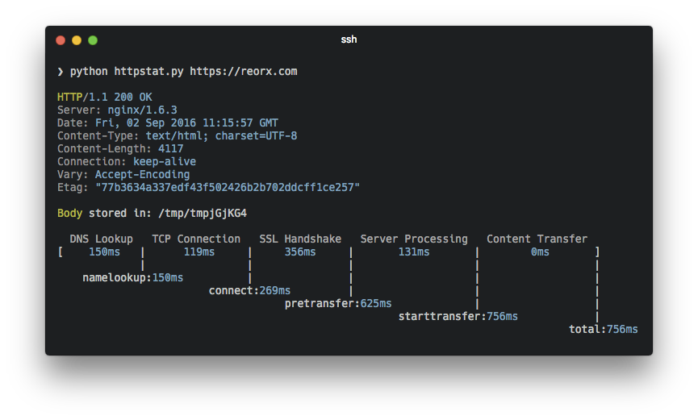

# httpstat



httpstat visualizes `curl(1)` statistics in a way of beauty and clarity.

It is a **single file🌟** Python script that has **no dependency👏** and is compatible with **Python 3🍻**.

## Features

- **Beautiful terminal output** — timing breakdown of DNS, TCP, TLS, server processing, and content transfer
- **Structured JSON output** — `--format json` / `jsonl` for machine consumption with a stable v1 schema
- **SLO threshold checking** — `--slo total=500,connect=100` exits with code 4 on violation
- **Save results to file** — `--save path.json` for multi-step workflows
- **NO_COLOR support** — respects the [NO_COLOR](https://no-color.org) convention


## Installation

There are three ways to get `httpstat`:

- Download the script directly: `wget https://raw.githubusercontent.com/reorx/httpstat/master/httpstat.py`

- Through pip: `pip install httpstat`

- Through homebrew (macOS only): `brew install httpstat`

> For Windows users, @davecheney's [Go version](https://github.com/davecheney/httpstat) is suggested. → [download link](https://github.com/davecheney/httpstat/releases)

## Usage

Simply:

```bash
python httpstat.py httpbin.org/get
```

If installed through pip or brew, you can use `httpstat` as a command:

```bash
httpstat httpbin.org/get
```

### cURL Options

Because `httpstat` is a wrapper of cURL, you can pass any cURL supported option after the url (except for `-w`, `-D`, `-o`, `-s`, `-S` which are already used by `httpstat`):

```bash
httpstat httpbin.org/post -X POST --data-urlencode "a=b" -v
```

### Structured Output

Use `--format` (`-f`) to get machine-readable output:

```bash
httpstat httpbin.org/get --format json
```

```json
{
  "schema_version": 1,
  "url": "httpbin.org/get",
  "ok": true,
  "exit_code": 0,
  "response": {
    "status_line": "HTTP/2 200",
    "status_code": 200,
    "remote_ip": "...",
    "remote_port": "443",
    "headers": "..."
  },
  "timings_ms": {
    "dns": 5, "connect": 10, "tls": 15,
    "server": 50, "transfer": 20, "total": 100,
    "namelookup": 5, "initial_connect": 15,
    "pretransfer": 30, "starttransfer": 80
  },
  "speed": { "download_kbs": 1234.5, "upload_kbs": 0.0 },
  "slo": null
}
```

Use `--format jsonl` for compact single-line JSON (useful for log pipelines).

### SLO Thresholds

Check response times against thresholds. Exits with code `4` on violation:

```bash
httpstat httpbin.org/get --slo total=500,connect=100,ttfb=200
```

Supported keys: `total`, `connect`, `ttfb` (time to first byte), `dns`, `tls`.

In pretty mode, violations are printed in red at the end of the output.
In JSON mode, violations appear in the `slo` field:

```json
{
  "slo": {
    "pass": false,
    "violations": [
      { "key": "total", "threshold_ms": 500, "actual_ms": 823 }
    ]
  }
}
```

### Save Results

Write structured JSON output to a file (works with any `--format`):

```bash
httpstat httpbin.org/get --save result.json
httpstat httpbin.org/get --format json --save result.json
```

### Environment Variables

`httpstat` has a bunch of environment variables to control its behavior.
Here are some usage demos, you can also run `httpstat --help` to see full explanation.

- <strong><code>HTTPSTAT_SHOW_BODY</code></strong>

  Set to `true` to show response body in the output, note that body length
  is limited to 1023 bytes, will be truncated if exceeds. Default is `false`.

- <strong><code>HTTPSTAT_SHOW_IP</code></strong>

  By default httpstat shows remote and local IP/port address.
  Set to `false` to disable this feature. Default is `true`.

- <strong><code>HTTPSTAT_SHOW_SPEED</code></strong>

  Set to `true` to show download and upload speed.  Default is `false`.

  ```bash
  HTTPSTAT_SHOW_SPEED=true httpstat http://cachefly.cachefly.net/10mb.test
  
  ...
  speed_download: 3193.3 KiB/s, speed_upload: 0.0 KiB/s
  ```

- <strong><code>HTTPSTAT_SAVE_BODY</code></strong>

  By default httpstat stores body in a tmp file,
  set to `false` to disable this feature. Default is `true`

- <strong><code>HTTPSTAT_CURL_BIN</code></strong>

  Indicate the cURL bin path to use. Default is `curl` from current shell $PATH.

  This exampe uses brew installed cURL to make HTTP2 request:

  ```bash
  HTTPSTAT_CURL_BIN=/usr/local/Cellar/curl/7.50.3/bin/curl httpstat https://http2.akamai.com/ --http2
  
  HTTP/2 200
  ...
  ```

  > cURL must be compiled with nghttp2 to enable http2 feature
  > ([#12](https://github.com/reorx/httpstat/issues/12)).

- <strong><code>HTTPSTAT_METRICS_ONLY</code></strong>

  If set to `true`, httpstat will only output metrics in json format,
  this is useful if you want to parse the data instead of reading it.

  > **Note**: This is kept for backward compatibility. Prefer `--format json` instead.

- <strong><code>HTTPSTAT_DEBUG</code></strong>

  Set to `true` to see debugging logs. Default is `false`

- <strong><code>NO_COLOR</code></strong>

  When set (to any value), disables all colored output.
  See [no-color.org](https://no-color.org) for the convention.

  ```bash
  NO_COLOR=1 httpstat httpbin.org/get
  ```


For convenience, you can export these environments in your `.zshrc` or `.bashrc`,
example:

```bash
export HTTPSTAT_SHOW_IP=false
export HTTPSTAT_SHOW_SPEED=true
export HTTPSTAT_SAVE_BODY=false
```

## Related Projects

Here are some implementations in various languages:


- Go: [davecheney/httpstat](https://github.com/davecheney/httpstat)

  This is the Go alternative of httpstat, it's written in pure Go and relies no external programs. Choose it if you like solid binary executions (actually I do).

- Go (library): [tcnksm/go-httpstat](https://github.com/tcnksm/go-httpstat)

  Other than being a cli tool, this project is used as library to help debugging latency of HTTP requests in Go code, very thoughtful and useful, see more in this [article](https://medium.com/@deeeet/trancing-http-request-latency-in-golang-65b2463f548c#.mm1u8kfnu)

- Bash: [b4b4r07/httpstat](https://github.com/b4b4r07/httpstat)

  This is what exactly I want to do at the very beginning, but gave up due to not confident in my bash skill, good job!

- Node: [yosuke-furukawa/httpstat](https://github.com/yosuke-furukawa/httpstat)

  [b4b4r07](https://twitter.com/b4b4r07) mentioned this in his [article](https://tellme.tokyo/post/2016/09/25/213810), could be used as a HTTP client also.

- PHP: [talhasch/php-httpstat](https://github.com/talhasch/php-httpstat)

  The PHP implementation by @talhasch

Some code blocks in `httpstat` are copied from other projects of mine, have a look:

- [reorx/python-terminal-color](https://github.com/reorx/python-terminal-color) Drop-in single file library for printing terminal color.

- [reorx/getenv](https://github.com/reorx/getenv) Environment variable definition with type.
